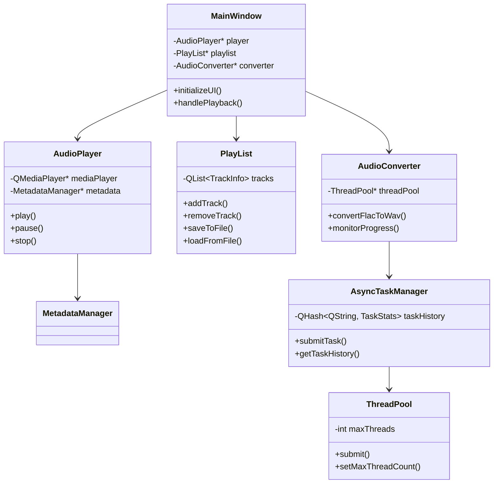
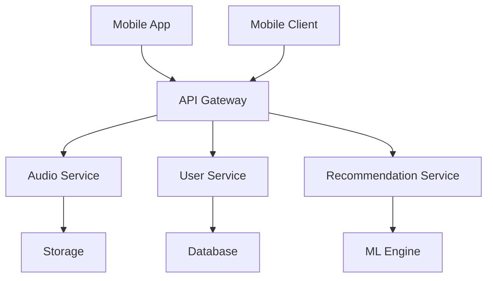

# Nexus - Music Player
## Technical Documentation for Development

### 1. System Architecture

#### 1.1 Component Diagram



#### 1.2 Component Interaction

#### MainWindow ↔ PlayList
- The main window communicates with PlayList via Qt signals and slots
- When adding a song: `MainWindow::onAddTrack() → PlayList::addTrack()`
- UI updates: `PlayList::trackAdded() → MainWindow::updatePlaylistView()`

#### MainWindow ↔ AudioPlayer
- Playback control via direct signals
- Playback state: `AudioPlayer::stateChanged() → MainWindow::updatePlaybackControls()`
- Progress: `AudioPlayer::positionChanged() → MainWindow::updateProgressBar()`

#### AudioConverter ↔ AsyncTaskManager
- Asynchronous file conversion
- Real-time progress monitoring
- Error handling and user notifications

#### 1.3 Technologies Used

#### Qt 6
- **Justification**: Modern framework with robust multi-platform support
- **Advantages**:
  - Native system widgets
  - Signal-slot system for component communication
  - Excellent documentation and active community

#### FFmpeg
- **Justification**: Industry-standard multimedia processing library
- **Advantages**:
  - Support for multiple audio formats
  - High-performance conversion
  - Constant updates with new codecs

### 2. Implemented Features

#### 2.1 User Interface


#### Main Components:
1. Top toolbar
2. Playlist
3. Playback controls
4. Progress bar
5. Track information panel

#### 2.2 Audio Playback
- Audio engine: QMediaPlayer
- Supported formats: MP3, WAV, FLAC, OGG
- Playback buffer: 2048 bytes
- Approximate latency: <100ms

#### 2.3 Playlist Management

#### File Format
```xml
<?xml version="1.0" encoding="UTF-8"?>
<playlist version="1.0">
    <track>
        <path>/path/to/file.mp3</path>
        <title>Track Title</title>
        <artist>Artist</artist>
        <duration>180</duration>
    </track>
</playlist>
```

#### Persistence
- Location: `~/.config/nexus/playlists/`
- Format: Custom XML
- Automatic backup every 5 minutes
- Automatic restore on startup

#### 2.4 Progress Bar
- Calculation based on processed bytes
- Update every 100ms
- Formula: `progress = (currentBytes * 100) / totalBytes`

### 3. Potential Areas for Improvement

#### 3.1 Priorities (Q1 2025)

1. High Priority
   - Streaming support (Spotify API)
   - Equalizer improvements
   - Memory optimization

2. Medium Priority
   - Device synchronization
   - Audio visualizations
   - Lyrics support

3. Low Priority
   - Custom themes
   - Playback statistics
   - Last.fm integration

### 4. API and Extensibility

#### 4.1 Main Signals and Slots

```cpp
// Example usage of signals and slots
connect(player, &AudioPlayer::stateChanged,
        this, &MainWindow::updatePlaybackState);

connect(playlist, &PlayList::trackChanged,
        player, &AudioPlayer::loadTrack);

// Error handling
connect(converter, &AudioConverter::conversionError,
        this, &MainWindow::showErrorDialog);
```

#### 4.2 Custom Events

```cpp
// Custom event definition
class TrackChangeEvent : public QEvent {
public:
    TrackChangeEvent(const QString& trackId)
        : QEvent(QEvent::Type(User + 1))
        , m_trackId(trackId) {}
        
    QString trackId() const { return m_trackId; }
    
private:
    QString m_trackId;
};
```

### 5. Environment Setup

#### 5.1 System Requirements

#### macOS
```bash
brew install qt@6
brew install ffmpeg
brew install taglib
```

#### Ubuntu/Debian
```bash
sudo apt install qt6-base-dev
sudo apt install ffmpeg
sudo apt install libtag1-dev
```

#### Windows
```powershell
vcpkg install qt6:x64-windows
vcpkg install ffmpeg:x64-windows
vcpkg install taglib:x64-windows
```

### 6. Contribution Guides

#### 6.1 Commit Format

```bash
# New features
feat: add support for audio visualizations

# Fixes
fix: resolve memory leak in audio conversion

# Documentation
docs: update installation instructions

# Refactoring
refactor: simplify playback logic
```

#### 6.2 Review Process

1. **Automated Review**
   - Linting (clang-format)
   - Unit tests
   - Code coverage

2. **Manual Review**
   - Design and architecture
   - Performance
   - Security
   - Documentation

### 7. Performance and Security

#### 7.1 Cache Management

```cpp
struct CacheEntry {
    QString originalPath;
    QString convertedPath;
    qint64 timestamp;
    qint64 size;
    QString checksum;
};
```

#### Cache Policy
- Maximum size: 1GB
- Lifetime: 7 days
- Strategy: LRU (Least Recently Used)

#### 7.2 File Sanitization

```cpp
class TempFileManager {
public:
    static QString createTempFile(const QString& prefix);
    static void cleanupOldFiles(const QDir& tempDir);
    static void secureDelete(const QString& path);
private:
    static void shredFile(const QString& path);
};
```

#### 7.3 Metadata Validation

```cpp
class MetadataValidator {
public:
    static bool validateTags(const TagLib::FileRef& file);
    static QString sanitizeString(const QString& input);
    static bool isValidEncoding(const QByteArray& data);
};
```

### 8. Monitoring and Logging

#### 8.1 Logging System

```cpp
enum class LogLevel {
    Debug,
    Info,
    Warning,
    Error,
    Critical
};

class Logger {
public:
    static void log(LogLevel level, const QString& message);
    static void setLogFile(const QString& path);
    static void enableConsoleOutput(bool enable);
};
```

#### 8.2 Performance Metrics

- File load time
- Memory usage
- Conversion time
- Playback latency

### 9. Roadmap and Future Planning

#### 9.1 Q1 2025 (January - March)
- Streaming implementation
  - Spotify Web API integration
  - OAuth 2.0 authentication
  - Playlist synchronization
- Equalizer improvements
  - Customizable presets
  - Real-time visualization
- Memory optimization
  - Intelligent buffering
  - Adaptive caching

#### 9.2 Q2 2025 (April - June)
- Plugin system
  - Extension API
  - Plugin marketplace
  - Update system
- Cloud synchronization
  - Google Drive integration
  - Dropbox support
  - iCloud compatibility
- Audio visualizations
  - Frequency spectrum
  - Waveforms
  - Custom visualizations

#### 9.3 Q3-Q4 2025 (July - December)

##### Integration with External Services
- **Spotify**
  ```json
  {
    "api_version": "v1",
    "endpoints": {
      "tracks": "/v1/tracks",
      "playlists": "/v1/playlists",
      "recommendations": "/v1/recommendations"
    },
    "features": [
      "search",
      "streaming",
      "recommendations"
    ]
  }
  ```

- **Last.fm**
  ```json
  {
    "api_version": "2.0",
    "endpoints": {
      "scrobble": "/2.0/?method=track.scrobble",
      "artist_info": "/2.0/?method=artist.getInfo",
      "similar_tracks": "/2.0/?method=track.getSimilar"
    },
    "features": [
      "scrobbling",
      "metadata",
      "recommendations"
    ]
  }
  ```

- **Apple Music**
  ```json
  {
    "api_version": "v1",
    "endpoints": {
      "catalog": "/v1/catalog",
      "library": "/v1/me/library",
      "playlists": "/v1/me/playlists"
    },
    "features": [
      "library",
      "playlists",
      "radio"
    ]
  }
  ```

##### Companion Mobile App

###### Architecture


###### Main Features
1. **Remote Control**
   ```swift
   protocol RemoteControl {
       func play()
       func pause()
       func skip()
       func setVolume(level: Float)
       func seekTo(position: TimeInterval)
   }
   ```

2. **Synchronization**
   ```swift
   struct SyncManager {
       var lastSync: Date
       var pendingChanges: [Change]
       var conflictResolution: ConflictStrategy
       
       func sync() async throws
       func resolveConflicts() async
       func applyChanges() async
   }
   ```

3. **Local Cache**
   ```swift
   class LocalCache {
       var maxSize: Int
       var retention: TimeInterval
       var strategy: CacheStrategy
       
       func store(_ data: Data, for key: String)
       func retrieve(_ key: String) -> Data?
       func clear()
   }
   ```

##### Recommendation System

###### Data Sources
- Playback history
- Track metadata
- Favorite genres
- Related artists
- Temporal trends

###### Algorithms
```python
class RecommendationEngine:
    def __init__(self):
        self.models = {
            'collaborative': CollaborativeFilter(),
            'content_based': ContentBasedFilter(),
            'hybrid': HybridRecommender()
        }
        
    def train(self, user_data, music_data):
        for model in self.models.values():
            model.fit(user_data, music_data)
            
    def get_recommendations(self, user_id, n=10):
        recommendations = []
        weights = {
            'collaborative': 0.4,
            'content_based': 0.3,
            'hybrid': 0.3
        }
        
        for model_name, weight in weights.items():
            model_recs = self.models[model_name].predict(user_id)
            recommendations.extend(
                (rec, score * weight) for rec, score in model_recs
            )
            
        return sorted(recommendations, key=lambda x: x[1], reverse=True)[:n]
```

#### 9.4 2026 and Beyond
- Artificial Intelligence
  - Playlist generation
  - Mood analysis
  - Assisted composition
- Augmented Reality
  - 3D visualizations
  - Immersive experiences
- IoT Integration
  - Smart home
  - Wearable devices

### 10. Implementation Considerations

#### 10.1 Microservices Architecture


##### Main Services

1. **Audio Service**
```typescript
interface AudioService {
    // File management
    uploadTrack(file: File): Promise<TrackMetadata>;
    convertFormat(trackId: string, format: AudioFormat): Promise<string>;
    
    // Streaming
    getStreamUrl(trackId: string): Promise<string>;
    getChunk(trackId: string, position: number): Promise<ArrayBuffer>;
    
    // Metadata
    updateMetadata(trackId: string, metadata: Partial<TrackMetadata>): Promise<void>;
    extractMetadata(trackId: string): Promise<TrackMetadata>;
}
```

2. **User Service**
```typescript
interface UserService {
    // Authentication
    login(credentials: Credentials): Promise<Session>;
    refresh(token: string): Promise<Session>;
    
    // Preferences
    getUserPreferences(userId: string): Promise<UserPreferences>;
    updatePreferences(userId: string, prefs: Partial<UserPreferences>): Promise<void>;
    
    // Synchronization
    getSyncStatus(userId: string): Promise<SyncStatus>;
    sync(userId: string, changes: Change[]): Promise<SyncResult>;
}
```

3. **Recommendation Service**
```typescript
interface RecommendationService {
    // Personalized recommendations
    getPersonalizedRecommendations(userId: string): Promise<Track[]>;
    
    // Taste analysis
    analyzeUserTaste(userId: string): Promise<TasteProfile>;
    
    // Discovery
    getDiscoveryPlaylist(userId: string): Promise<Playlist>;
    getSimilarTracks(trackId: string): Promise<Track[]>;
}
```

#### 10.2 Resource Optimization

##### Memory Management
```cpp
class MemoryManager {
public:
    // Limit configuration
    struct Limits {
        size_t maxCacheSize;
        size_t maxPlaylistSize;
        size_t maxConcurrentConversions;
    };
    
    // Usage monitoring
    struct Usage {
        size_t currentCacheSize;
        size_t activeConversions;
        vector<MemoryBlock> allocations;
    };
    
    void setLimits(const Limits& limits);
    Usage getCurrentUsage() const;
    
    // Cache management
    void trimCache();
    void preloadTrack(const QString& trackId);
    void releaseTrack(const QString& trackId);
    
private:
    Limits m_limits;
    QCache<QString, AudioData> m_audioCache;
    QMap<QString, std::shared_ptr<ConversionTask>> m_activeConversions;
};
```

##### Network Optimization
```cpp
class NetworkManager {
public:
    // Streaming configuration
    struct StreamConfig {
        size_t chunkSize;
        size_t prefetchCount;
        int maxRetries;
        bool enableCompression;
    };
    
    // Bandwidth control
    void setBandwidthLimit(size_t bytesPerSecond);
    void setPriority(RequestType type, int priority);
    
    // Connection management
    QNetworkReply* sendRequest(const NetworkRequest& request);
    void cancelRequest(const QString& requestId);
    
private:
    QNetworkAccessManager m_manager;
    QQueue<NetworkRequest> m_requestQueue;
    QMap<QString, BandwidthQuota> m_quotas;
};
```

#### 10.3 Security

##### Data Encryption
```cpp
class SecurityManager {
public:
    // File encryption
    QByteArray encryptFile(const QString& filePath, const QString& key);
    bool decryptFile(const QString& filePath, const QString& key);
    
    // Key management
    QString generateKey() const;
    bool validateKey(const QString& key) const;
    
    // Input sanitization
    QString sanitizeFileName(const QString& fileName) const;
    bool validateFileSignature(const QString& filePath) const;
    
private:
    QCryptographicHash m_hash;
    QAESCipher m_cipher;
};
```

#### 10.4 Testing and QA

##### Unit Tests
```cpp
class AudioConverterTest : public QObject {
    Q_OBJECT
    
private slots:
    void initTestCase();
    void testConversion_data();
    void testConversion();
    void testErrorHandling();
    void testProgressTracking();
    void cleanupTestCase();
    
private:
    AudioConverter* m_converter;
    QTemporaryDir m_tempDir;
};
```

##### Integration Tests
```python
class IntegrationTests:
    def setUp(self):
        self.app = TestApp()
        self.client = TestClient()
        
    def test_end_to_end_playback(self):
        # Upload file
        track_id = self.client.upload_file("test.mp3")
        
        # Verify conversion
        status = self.client.wait_for_conversion(track_id)
        self.assertTrue(status.success)
        
        # Test playback
        player = self.app.get_player()
        player.load_track(track_id)
        player.play()
        
        # Verify progress
        self.assertTrue(self.wait_for_playback_progress())
```

### 11. Metrics and Monitoring

#### 11.1 Telemetry

```typescript
interface TelemetryData {
    // Performance
    loadTime: number;
    memoryUsage: number;
    cpuUsage: number;
    
    // Usage
    activeUsers: number;
    playbackSessions: number;
    conversionJobs: number;
    
    // Errors
    errorCount: number;
    errorTypes: Record<string, number>;
    
    // Network
    bandwidth: number;
    latency: number;
    packetLoss: number;
}

class TelemetryCollector {
    private metrics: TelemetryData;
    
    collectMetrics(): void {
        // Implementation
    }
    
    analyzeTrends(): TrendAnalysis {
        // Implementation
    }
    
    generateReport(): Report {
        // Implementation
    }
}
```

#### 11.2 Alerts

```yaml
alerts:
  high_memory:
    condition: memory_usage > 90%
    duration: 5m
    severity: critical
    actions:
      - notify_team
      - reduce_cache
      
  high_error_rate:
    condition: error_rate > 5%
    duration: 15m
    severity: warning
    actions:
      - notify_team
      - log_details
      
  service_latency:
    condition: avg_response_time > 500ms
    duration: 10m
    severity: warning
    actions:
      - scale_service
      - notify_team
```

---

*Last updated: 2025-01-09*
