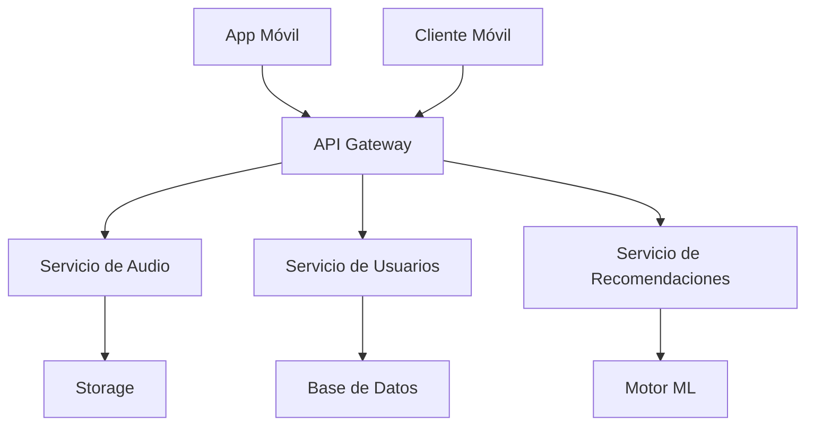
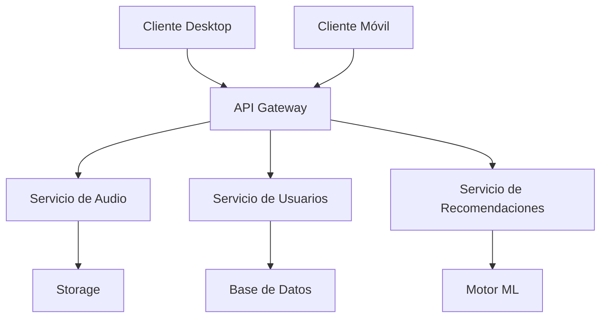

# Nexus - Reproductor de Música
## Documentación Técnica para Desarrollo

### 1. Arquitectura del Sistema

#### 1.1 Diagrama de Componentes


#### 1.2 Interacción entre Componentes

#### MainWindow ↔ PlayList
- La ventana principal se comunica con PlayList mediante señales y slots de Qt
- Cuando se agrega una canción: `MainWindow::onAddTrack() → PlayList::addTrack()`
- Actualizaciones de UI: `PlayList::trackAdded() → MainWindow::updatePlaylistView()`

#### MainWindow ↔ AudioPlayer
- Control de reproducción mediante señales directas
- Estado de reproducción: `AudioPlayer::stateChanged() → MainWindow::updatePlaybackControls()`
- Progreso: `AudioPlayer::positionChanged() → MainWindow::updateProgressBar()`

#### AudioConverter ↔ AsyncTaskManager
- Conversión asíncrona de archivos
- Monitoreo de progreso en tiempo real
- Manejo de errores y notificaciones al usuario

#### 1.3 Tecnologías Utilizadas

#### Qt 6
- **Justificación**: Framework moderno con soporte multiplataforma robusto
- **Ventajas**:
  - Widgets nativos del sistema operativo
  - Sistema de señales y slots para comunicación entre componentes
  - Excelente documentación y comunidad activa

#### FFmpeg
- **Justificación**: Biblioteca estándar de la industria para procesamiento multimedia
- **Ventajas**:
  - Soporte para múltiples formatos de audio
  - Alto rendimiento en conversión
  - Actualización constante con nuevos codecs

### 2. Funcionalidades Implementadas

#### 2.1 Interfaz de Usuario


#### Componentes Principales:
1. Barra de herramientas superior
2. Lista de reproducción
3. Controles de reproducción
4. Barra de progreso
5. Panel de información de la pista

#### 2.2 Reproducción de Audio
- Motor de audio: QMediaPlayer
- Formatos soportados: MP3, WAV, FLAC, OGG
- Buffer de reproducción: 2048 bytes
- Latencia aproximada: <100ms

#### 2.3 Gestión de Lista de Reproducción

#### Formato de Archivo
```xml
<?xml version="1.0" encoding="UTF-8"?>
<playlist version="1.0">
    <track>
        <path>/ruta/al/archivo.mp3</path>
        <title>Título de la Canción</title>
        <artist>Artista</artist>
        <duration>180</duration>
    </track>
</playlist>
```

#### Persistencia
- Ubicación: `~/.config/nexus/playlists/`
- Formato: XML personalizado
- Backup automático cada 5 minutos
- Restauración automática al inicio

#### 2.4 Barra de Progreso
- Cálculo basado en bytes procesados
- Actualización cada 100ms
- Fórmula: `progreso = (bytesActuales * 100) / bytesTotales`

### 3. Áreas de Mejora Potencial

#### 3.1 Prioridades (Q1 2025)

1. Alta Prioridad
   - Soporte para streaming (Spotify API)
   - Mejoras en el ecualizador
   - Optimización de memoria

2. Media Prioridad
   - Sincronización entre dispositivos
   - Visualizaciones de audio
   - Soporte para letras de canciones

3. Baja Prioridad
   - Temas personalizados
   - Estadísticas de reproducción
   - Integración con Last.fm

### 4. API y Extensibilidad

#### 4.1 Señales y Slots Principales

```cpp
// Ejemplo de uso de señales y slots
connect(player, &AudioPlayer::stateChanged,
        this, &MainWindow::updatePlaybackState);

connect(playlist, &PlayList::trackChanged,
        player, &AudioPlayer::loadTrack);

// Manejo de errores
connect(converter, &AudioConverter::conversionError,
        this, &MainWindow::showErrorDialog);
```

#### 4.2 Eventos Personalizados

```cpp
// Definición de evento personalizado
class TrackChangeEvent : public QEvent {
public:
    TrackChangeEvent(const QString& trackId)
        : QEvent(QEvent::Type(User + 1))
        , m_trackId(trackId) {}
        
    QString trackId() const { return m_trackId; }
    
private:
    QString m_trackId;
};
```

### 5. Configuración del Entorno

#### 5.1 Requisitos del Sistema

#### macOS
```bash
brew install qt@6
brew install ffmpeg
brew install taglib
```

#### Ubuntu/Debian
```bash
sudo apt install qt6-base-dev
sudo apt install ffmpeg
sudo apt install libtag1-dev
```

#### Windows
```powershell
vcpkg install qt6:x64-windows
vcpkg install ffmpeg:x64-windows
vcpkg install taglib:x64-windows
```

### 6. Guías de Contribución

#### 6.1 Formato de Commits

```bash
# Nuevas características
feat: agregar soporte para visualizaciones de audio

# Correcciones
fix: resolver memory leak en conversión de audio

# Documentación
docs: actualizar instrucciones de instalación

# Refactorización
refactor: simplificar lógica de reproducción
```

#### 6.2 Proceso de Revisión

1. **Revisión Automática**
   - Linting (clang-format)
   - Tests unitarios
   - Cobertura de código

2. **Revisión Manual**
   - Diseño y arquitectura
   - Rendimiento
   - Seguridad
   - Documentación

### 7. Rendimiento y Seguridad

#### 7.1 Gestión de Caché

```cpp
struct CacheEntry {
    QString originalPath;
    QString convertedPath;
    qint64 timestamp;
    qint64 size;
    QString checksum;
};
```

#### Política de Caché
- Tamaño máximo: 1GB
- Tiempo de vida: 7 días
- Estrategia: LRU (Least Recently Used)

#### 7.2 Sanitización de Archivos

```cpp
class TempFileManager {
public:
    static QString createTempFile(const QString& prefix);
    static void cleanupOldFiles(const QDir& tempDir);
    static void secureDelete(const QString& path);
private:
    static void shredFile(const QString& path);
};
```

#### 7.3 Validación de Metadatos

```cpp
class MetadataValidator {
public:
    static bool validateTags(const TagLib::FileRef& file);
    static QString sanitizeString(const QString& input);
    static bool isValidEncoding(const QByteArray& data);
};
```

### 8. Monitoreo y Logging

#### 8.1 Sistema de Logging

```cpp
enum class LogLevel {
    Debug,
    Info,
    Warning,
    Error,
    Critical
};

class Logger {
public:
    static void log(LogLevel level, const QString& message);
    static void setLogFile(const QString& path);
    static void enableConsoleOutput(bool enable);
};
```

#### 8.2 Métricas de Rendimiento

- Tiempo de carga de archivos
- Uso de memoria
- Tiempo de conversión
- Latencia de reproducción

### 9. Roadmap y Planificación Futura

#### 9.1 Q1 2025 (Enero - Marzo)
- Implementación de streaming
  - Integración con Spotify Web API
  - Autenticación OAuth 2.0
  - Sincronización de playlists
- Mejoras en el ecualizador
  - Presets personalizables
  - Visualización en tiempo real
- Optimización de memoria
  - Buffering inteligente
  - Caché adaptativa

#### 9.2 Q2 2025 (Abril - Junio)
- Sistema de plugins
  - API de extensiones
  - Marketplace de plugins
  - Sistema de actualizaciones
- Sincronización en la nube
  - Google Drive integration
  - Dropbox support
  - iCloud compatibility
- Visualizaciones de audio
  - Espectro de frecuencia
  - Formas de onda
  - Visualizaciones personalizadas

#### 9.3 Q3-Q4 2025 (Julio - Diciembre)

##### Integración con Servicios Externos
- **Spotify**
  ```json
  {
    "api_version": "v1",
    "endpoints": {
      "tracks": "/v1/tracks",
      "playlists": "/v1/playlists",
      "recommendations": "/v1/recommendations"
    },
    "features": [
      "búsqueda",
      "streaming",
      "recomendaciones"
    ]
  }
  ```

- **Last.fm**
  ```json
  {
    "api_version": "2.0",
    "endpoints": {
      "scrobble": "/2.0/?method=track.scrobble",
      "artist_info": "/2.0/?method=artist.getInfo",
      "similar_tracks": "/2.0/?method=track.getSimilar"
    },
    "features": [
      "scrobbling",
      "metadatos",
      "recomendaciones"
    ]
  }
  ```

- **Apple Music**
  ```json
  {
    "api_version": "v1",
    "endpoints": {
      "catalog": "/v1/catalog",
      "library": "/v1/me/library",
      "playlists": "/v1/me/playlists"
    },
    "features": [
      "biblioteca",
      "playlists",
      "radio"
    ]
  }
  ```

##### Aplicación Móvil Companion

###### Arquitectura


###### Funcionalidades Principales
1. **Control Remoto**
   ```swift
   protocol RemoteControl {
       func play()
       func pause()
       func skip()
       func setVolume(level: Float)
       func seekTo(position: TimeInterval)
   }
   ```

2. **Sincronización**
   ```swift
   struct SyncManager {
       var lastSync: Date
       var pendingChanges: [Change]
       var conflictResolution: ConflictStrategy
       
       func sync() async throws
       func resolveConflicts() async
       func applyChanges() async
   }
   ```

3. **Caché Local**
   ```swift
   class LocalCache {
       var maxSize: Int
       var retention: TimeInterval
       var strategy: CacheStrategy
       
       func store(_ data: Data, for key: String)
       func retrieve(_ key: String) -> Data?
       func clear()
   }
   ```

##### Sistema de Recomendaciones

###### Fuentes de Datos
- Historial de reproducción
- Metadatos de canciones
- Géneros favoritos
- Artistas relacionados
- Tendencias temporales

###### Algoritmos
```python
class RecommendationEngine:
    def __init__(self):
        self.models = {
            'collaborative': CollaborativeFilter(),
            'content_based': ContentBasedFilter(),
            'hybrid': HybridRecommender()
        }
        
    def train(self, user_data, music_data):
        for model in self.models.values():
            model.fit(user_data, music_data)
            
    def get_recommendations(self, user_id, n=10):
        recommendations = []
        weights = {
            'collaborative': 0.4,
            'content_based': 0.3,
            'hybrid': 0.3
        }
        
        for model_name, weight in weights.items():
            model_recs = self.models[model_name].predict(user_id)
            recommendations.extend(
                (rec, score * weight) for rec, score in model_recs
            )
            
        return sorted(recommendations, key=lambda x: x[1], reverse=True)[:n]
```

#### 9.4 2026 y Más Allá
- Inteligencia Artificial
  - Generación de playlists
  - Análisis de estado de ánimo
  - Composición asistida
- Realidad Aumentada
  - Visualizaciones 3D
  - Experiencias inmersivas
- Integración IoT
  - Smart home
  - Dispositivos wearables

### 10. Consideraciones de Implementación

#### 10.1 Arquitectura de Microservicios



##### Servicios Principales

1. **Servicio de Audio**
```typescript
interface AudioService {
  // Gestión de archivos
  uploadTrack(file: File): Promise<TrackMetadata>;
  convertFormat(trackId: string, format: AudioFormat): Promise<string>;
  
  // Streaming
  getStreamUrl(trackId: string): Promise<string>;
  getChunk(trackId: string, position: number): Promise<ArrayBuffer>;
  
  // Metadatos
  updateMetadata(trackId: string, metadata: Partial<TrackMetadata>): Promise<void>;
  extractMetadata(trackId: string): Promise<TrackMetadata>;
}
```

2. **Servicio de Usuarios**
```typescript
interface UserService {
  // Autenticación
  login(credentials: Credentials): Promise<Session>;
  refresh(token: string): Promise<Session>;
  
  // Preferencias
  getUserPreferences(userId: string): Promise<UserPreferences>;
  updatePreferences(userId: string, prefs: Partial<UserPreferences>): Promise<void>;
  
  // Sincronización
  getSyncStatus(userId: string): Promise<SyncStatus>;
  sync(userId: string, changes: Change[]): Promise<SyncResult>;
}
```

3. **Servicio de Recomendaciones**
```typescript
interface RecommendationService {
  // Recomendaciones personalizadas
  getPersonalizedRecommendations(userId: string): Promise<Track[]>;
  
  // Análisis de gustos
  analyzeUserTaste(userId: string): Promise<TasteProfile>;
  
  // Descubrimiento
  getDiscoveryPlaylist(userId: string): Promise<Playlist>;
  getSimilarTracks(trackId: string): Promise<Track[]>;
}
```

#### 10.2 Optimización de Recursos

##### Gestión de Memoria
```cpp
class MemoryManager {
public:
    // Configuración de límites
    struct Limits {
        size_t maxCacheSize;
        size_t maxPlaylistSize;
        size_t maxConcurrentConversions;
    };
    
    // Monitoreo de uso
    struct Usage {
        size_t currentCacheSize;
        size_t activeConversions;
        vector<MemoryBlock> allocations;
    };
    
    void setLimits(const Limits& limits);
    Usage getCurrentUsage() const;
    
    // Gestión de caché
    void trimCache();
    void preloadTrack(const QString& trackId);
    void releaseTrack(const QString& trackId);
    
private:
    Limits m_limits;
    QCache<QString, AudioData> m_audioCache;
    QMap<QString, std::shared_ptr<ConversionTask>> m_activeConversions;
};
```

##### Optimización de Red
```cpp
class NetworkManager {
public:
    // Configuración de streaming
    struct StreamConfig {
        size_t chunkSize;
        size_t prefetchCount;
        int maxRetries;
        bool enableCompression;
    };
    
    // Control de ancho de banda
    void setBandwidthLimit(size_t bytesPerSecond);
    void setPriority(RequestType type, int priority);
    
    // Gestión de conexiones
    QNetworkReply* sendRequest(const NetworkRequest& request);
    void cancelRequest(const QString& requestId);
    
private:
    QNetworkAccessManager m_manager;
    QQueue<NetworkRequest> m_requestQueue;
    QMap<QString, BandwidthQuota> m_quotas;
};
```

#### 10.3 Seguridad

##### Cifrado de Datos
```cpp
class SecurityManager {
public:
    // Cifrado de archivos
    QByteArray encryptFile(const QString& filePath, const QString& key);
    bool decryptFile(const QString& filePath, const QString& key);
    
    // Gestión de claves
    QString generateKey() const;
    bool validateKey(const QString& key) const;
    
    // Sanitización
    QString sanitizeFileName(const QString& fileName) const;
    bool validateFileSignature(const QString& filePath) const;
    
private:
    QCryptographicHash m_hash;
    QAESCipher m_cipher;
};
```

#### 10.4 Testing y QA

##### Tests Unitarios
```cpp
class AudioConverterTest : public QObject {
    Q_OBJECT
    
private slots:
    void initTestCase();
    void testConversion_data();
    void testConversion();
    void testErrorHandling();
    void testProgressTracking();
    void cleanupTestCase();
    
private:
    AudioConverter* m_converter;
    QTemporaryDir m_tempDir;
};
```

##### Tests de Integración
```python
class IntegrationTests:
    def setUp(self):
        self.app = TestApp()
        self.client = TestClient()
        
    def test_end_to_end_playback(self):
        # Subir archivo
        track_id = self.client.upload_file("test.mp3")
        
        # Verificar conversión
        status = self.client.wait_for_conversion(track_id)
        self.assertTrue(status.success)
        
        # Probar reproducción
        player = self.app.get_player()
        player.load_track(track_id)
        player.play()
        
        # Verificar progreso
        self.assertTrue(self.wait_for_playback_progress())
```

### 11. Métricas y Monitoreo

#### 11.1 Telemetría

```typescript
interface TelemetryData {
    // Rendimiento
    loadTime: number;
    memoryUsage: number;
    cpuUsage: number;
    
    // Uso
    activeUsers: number;
    playbackSessions: number;
    conversionJobs: number;
    
    // Errores
    errorCount: number;
    errorTypes: Record<string, number>;
    
    // Red
    bandwidth: number;
    latency: number;
    packetLoss: number;
}

class TelemetryCollector {
    private metrics: TelemetryData;
    
    collectMetrics(): void {
        // Implementación
    }
    
    analyzeTrends(): TrendAnalysis {
        // Implementación
    }
    
    generateReport(): Report {
        // Implementación
    }
}
```

#### 11.2 Alertas

```yaml
alerts:
  high_memory:
    condition: memory_usage > 90%
    duration: 5m
    severity: critical
    actions:
      - notify_team
      - reduce_cache
      
  high_error_rate:
    condition: error_rate > 5%
    duration: 15m
    severity: warning
    actions:
      - notify_team
      - log_details
      
  service_latency:
    condition: avg_response_time > 500ms
    duration: 10m
    severity: warning
    actions:
      - scale_service
      - notify_team
```

---

*Última actualización: 2025-01-09*
